# Shark attacks dependency on El Niño effects on the American and Australian coastlines

### A study of the attacks report during the years 1983-2018
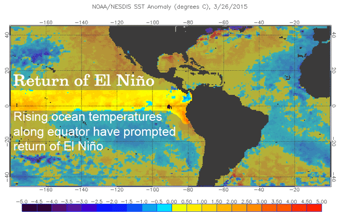

El Niño is a climate pattern that describes the unusual warming of surface waters in the eastern tropical Pacific Ocean. El Niño is the “warm phase” of a larger phenomenon called the El Niño-Southern Oscillation (ENSO). La Niña, the “cool phase” of ENSO, is a pattern that describes the unusual cooling of the region’s surface waters.

El Niño has an impact on ocean temperatures, the speed and strength of ocean currents, the health of coastal fisheries, and local weather from Australia to South America and beyond. El Niño events occur irregularly at two- to seven-year intervals. However, El Niño is not a regular cycle, or predictable in the sense that ocean tides are. 

The 2015 El Niño may have had a significant impact on weather and climate, but that’s not all. Researchers are blaming El Niño for increased numbers of shark sightings on the West Coast. A recent study by the International Shark Attack File (ISAF), has confirmed that the worldwide shark attacks reached an all-time record high in 2015. Accordingly, the number of unprovoked shark attacks on humans around the world has increased to about 98. The previous record of 88 was set back in 2000.

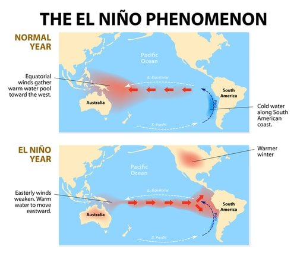

## 1. Objective

Our  null hypothesis is that the data really shows an increase of cases during El Niño years, having a possible link between them.

### Disclaimer

Although it is known that El Niño affects mainly the shouthern coasts of America, in 2015 there was an extra phenomena called Subtropical Jet Stream that increased the effect of El Niño on the North American Eastern and Western coasts. For the purposes of this work, all US cases from both coasts will be taken as they were all affected by El Niño.

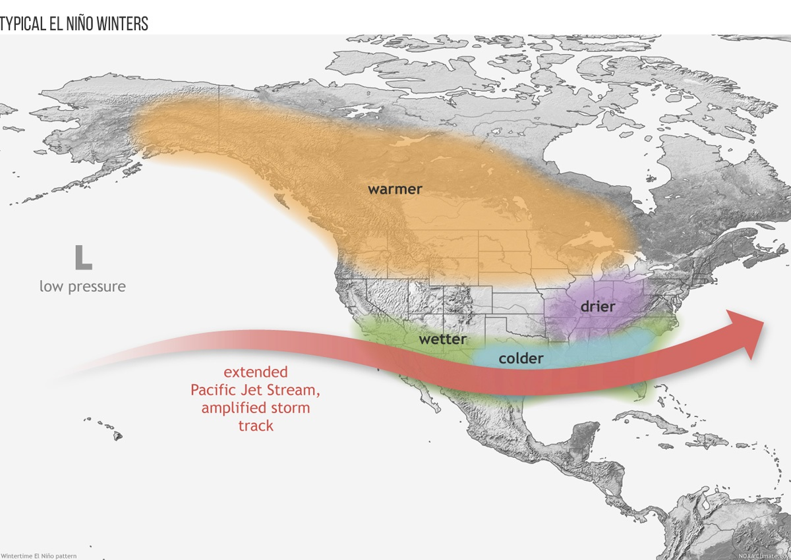

## 2. Data acquisition

The following report was extracted from Kaggle, "Global Shark Attacks", by Toby Jolly. The original database is from https://www.sharkattackfile.net/index.htm

####URL to the Kaggle

https://www.kaggle.com/teajay/global-shark-attacks

*Note: the original data is not added to this repository
```python
#my code here
```
## 3. Opening the files


## 4. Data wrangling and cleaning

You can find the cleaned data in src/Data_cleaning.ipynb.

The first step was to explore the complete dataset. It had the shape of 25723 rows and 24 columns. There were multitude of rows that could be removed, such as "pdf", "name" of the case, "case number" and so on. Some other columns were properly renamed.

The second step was to get rid of the Null and NaN values. A how="all".dropna() was applied to the rows.
After these two steps, the shape resized to 6302 rows and 12 columns.


Still with a lot of NaNs, it was time to explore how to handle with the invalid values. In statistics there are multiple ways to solve this situation. In this case a listwise criteria was implemented.

If the column has more than 90% of the NaNs, those are deleted from the dataframe.


The shape was resized to 2975 rows and 12 columns.

The following steps were:

- Cleaning the "Date" column: extracting the Month from the whole date. Used set.extraction method with Regex.
- Cleaning the "Species" column: extracting only the Type + Shark strings. Used Regex construction.
- Cleaning the "Age" column: got rid of unwanted strings.
- Cleaning the "Country" column: entitled and replaced the strings. Elimination of duplicates.
- Cleaning the "Sex" column: removed unwanted duplicates and invalid variables.
- Cleaning the "Fatality column": removed unwanted duplicates and invalid variables. Used Regex.
- Cleaning the "Type" column: removed invalid variables with Regex
- Resseting the indexes
- Saving the new dataset as a new cleaned dataframe, called "attacks_cleaned.csv".

## 5. Data visualization and data analysis

Because we want to compare the number of cases of 2015 with the rest of the years and also other El Niño years, our main columns will be "Month" and "Year". El Niño is a seasonal phenomena, therefore we need to see the differences month by month.


It is thought that there have been at least 30 El Niño events since 1900, with the 1982–83, 1997–98 and 2014–16 events among the strongest on record.

Major ENSO events were recorded in the following years:

- 1790-93
- 1828
- 1876-78
- 1891
- 1925-26
- 1972-73
- 1982-83
- 1997-98
- 2014-16

### 5.1 Methods and results

#### Total cases per year:

This would be the first approach to solve the mistery. By exploring the total cases during all these years, an increase should be seen in those years where El Niño had a stronger effect.


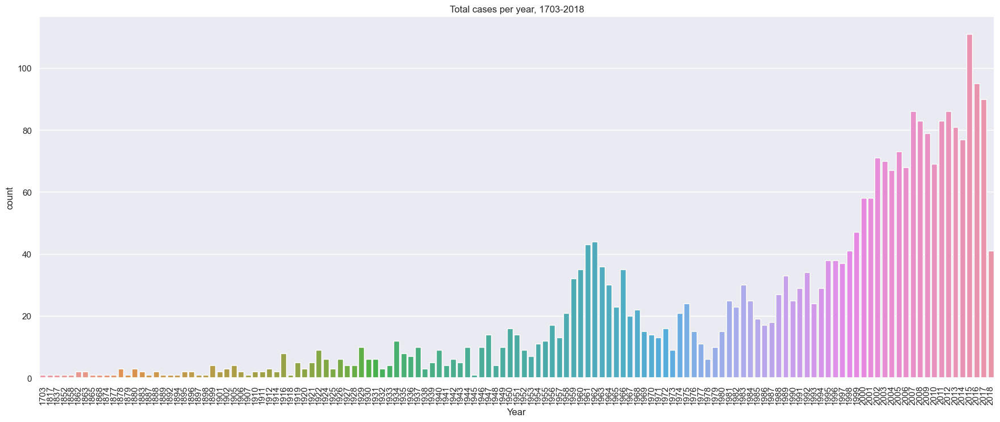

The worst recent cases of El Niño were in 1982-83, 1997-83 and 2014-15. This phenomena normal has its peak around December/January, therefore there should be an increase of shark attacks in the following year when El Niño started.

By looking at the plot above, there are higher peaks in 1982, 1988 and 2015 than the corresponding previous year, although some of the peaks might be more clear than the others. This information is very valuable, because it might be a good approximation to validate our hypothesis.

####Total cases per month:

The other side of the coin is to see the total number of cases per month. We could expect more attacks during the summer in North America, therefore more attacks during winter time in South America and Australia. Warmer temperatures let people enjoy the weather and go swimming in the sea, potentially attracting sharks.

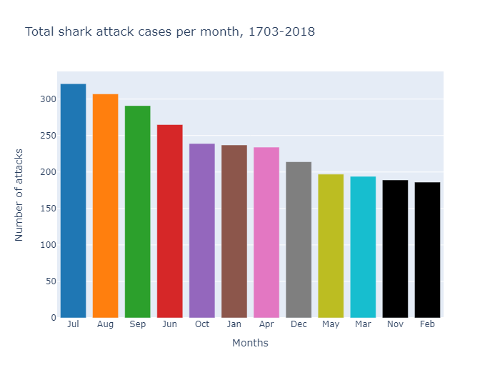

Again, it seems July and August (Summer season) are months were most attacks are reported. However, we must disgregate this data and check to which country corresponds all these attacks. Therefore, we could link the El Niño peaks with the Season and Country.

####Total cases per country:

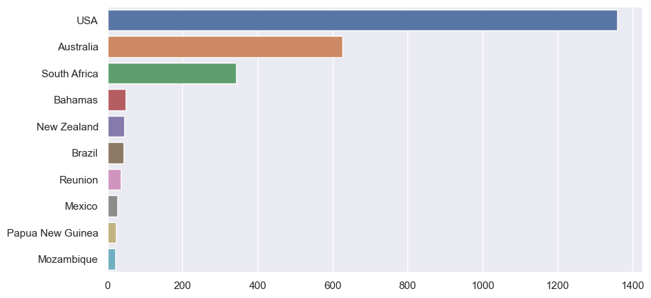

As expected, USA (1359) and Australia (626) lead the chart with the most shark attacks. They are followed by South Africa (342) and other countries from the Pacific: New Zealand (44) and Papua New Guinea (22). 

At this point, one might think about the South American countries: sadly, there are not many reports, either because there were not reported or either because the database is incomplete.

Nevertheless, this is gonna be the dataset from now on.

####Total cases per month and country:

With the necessary insights, it was time to relate the season and the countries.

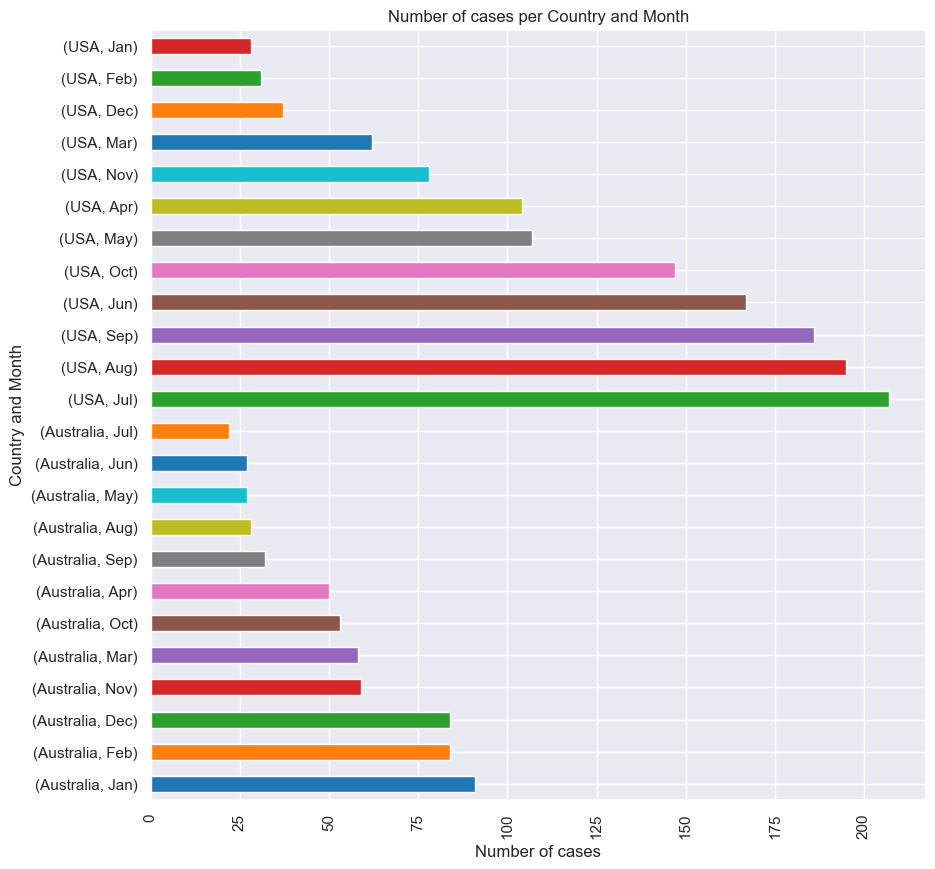

This graphic confirms the relationship between El Niño effects in different seasons. While in America the attacks increased in summer, in Australia it was winter.

#### Number of cases during El Niño years:

By analyzing the previous, current and later years of El Niño it should be possible to see an increase of cases. Sharks are migratory species, but when El Niño occurs, they tend to stay in warm waters more time, therefore increasing the probability to an unfortunate encounter with a human.


###5.2 Discussion of the results. Hypothesis validation

It's important to remember the worst El Niño cases:

- 1982–83, 
- 1997–98,
- 2014–16

By looking at the last plot, it seems there is some kind of correlation between the closer year to a El Niño phenomenon with shark attacks.

For example, between the years 1980 and 1983, the closer the year is to 1983, the more significant number of attacks occurred in the USA due to warmer waters. The number increases in Australia, too, although this number should decrease: the waters are cooler.

However, between the years 1995-1999 the pattern doesn't repeat for the USA, although there is a logical decrease on the Australian waters. Nevertheless, the number of cases have been multiplicated x10. There are two possible explanations: the reports are more efficient and quicker with the new technologies from the decade, or there is another variable that affect the numbers.

2015 was categorized as the worst phenomenon ever: the effect on sharks is clearly visible, reaching its peak in that year and decreasing the number of cases the following years.

A good alternative to evaluate the data is to plot it as a linear graphic.

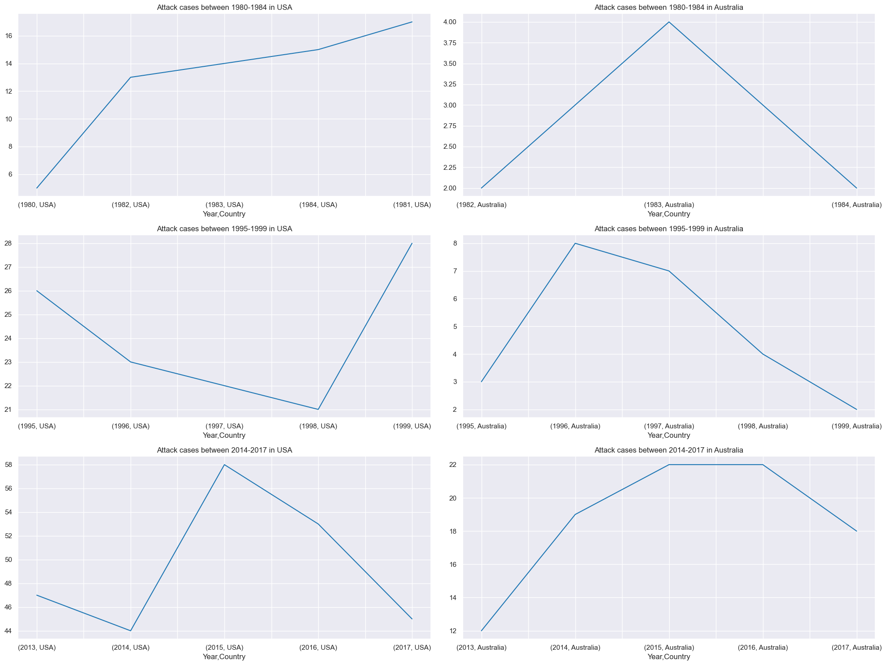

It is possible to see the peaks in the year 1982 and 2015 in the USA shore, and  in 1983, 1996 and 2015 in the Australian shore. Both coincide with El Niño effect.

##6. 2015: the worst year

Spurred by warm water, 2015 set a new record for shark attacks around the world, with 98 incidents, including six human fatalities.

According to the International Shark Attack File, the main drivers for the rise in incidents were warm water from El Niño and global warming (2015 was also the hottest year on record), a lack of severe storms in most developed countries, and a relatively strong economy that sent more vacationers to the beach.


### 6.1 Shark attacks by gender

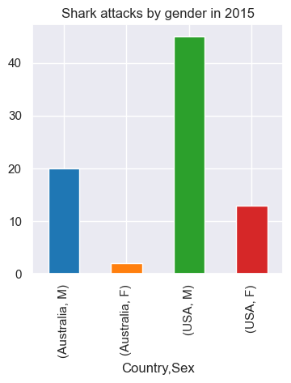

Males are more killed than Females

### 6.2 Shark fatalities

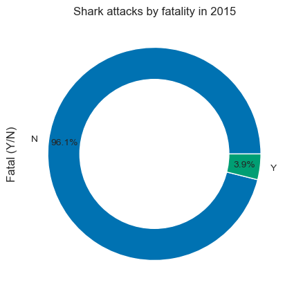

The total case of fatalietes were 3.9% between Australia and the USA. This represents a very low percentage from the total amount of cases. In fact, is most probable to get hit by a car than bitten by a shark!

### 6.3 Shark attacks by species

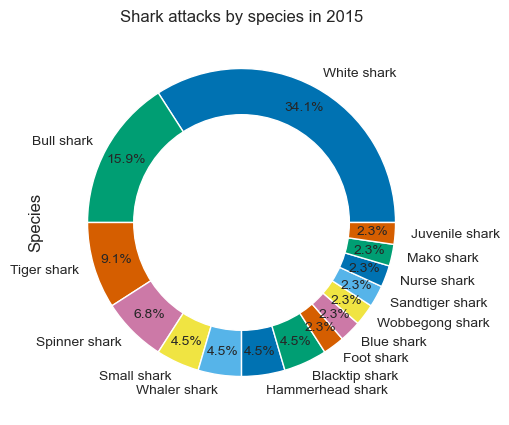

White, bull and tiger sharks are the ones leading the attacks. This data is validated by the newspaper archive (see Links and Resources).

### 6.4 Shark attacks by age and country


The darker the colour, the more quantity.

### 6.5 Shark attacks by the type of the encounter

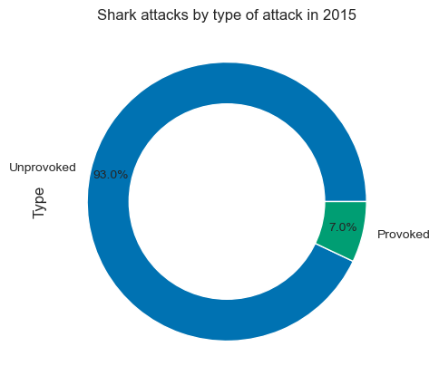

## 7. Conclusions

In this analysis, the effect of El Niño on shark attacks over the last 40 years has been studied.  It has been shown that there is a certain relationship between the dates on which the phenomenon coincides with the increase in attacks on the west coast of the American continent. However, better data acquisition and validation would be needed to prove this hypothesis.

The biggest phenomenon of the century occurred in 2015. Details of these attacks are now available, such as the fact that the male gender is the most affected, although the number of fatalities was very low, less than 4%. The age range most affected is between 0 and 20 years old.

The great white shark is the species that produces the most attacks, followed by the tiger shark and the spinner shark. Most attacks were unprovoked.

## Links and Resources

- https://climate.nasa.gov/news/2351/studying-2015-el-nino-event-as-never-before/
- https://sealevel.jpl.nasa.gov/data/el-nino-la-nina-watch-and-pdo/el-nino-2015/
- https://www.nationalgeographic.com/animals/article/160209-2015-shark-attacks-el-nino-economy
- http://www.bom.gov.au/climate/updates/articles/a008-el-nino-and-australia.shtml
- https://www.dailytelegraph.com.au/news/nsw/lismore/shark-attacks-increase-in-el-nino-years-marine-biologist/news-story/2b94b0217d90d42f8f90ba71cb52bebd
- https://www.accuweather.com/en/weather-news/decrease-in-us-shark-attacks-following-record-year-may-be-linked-to-fading-el-nino/366004
- https://www.skymetweather.com/content/climate-change/el-nino-responsible-for-record-number-of-shark-attacks-in-2015/
- https://phys.org/news/2016-07-el-nino-sharks-marine-life.html
- https://www.kold.com/story/29885876/el-nino-could-be-linked-to-more-shark-attracts/
- https://www.climate.gov/media/13109
- https://www.latimes.com/local/lanow/la-me-ln-el-nino-sharks-20150916-story.html


